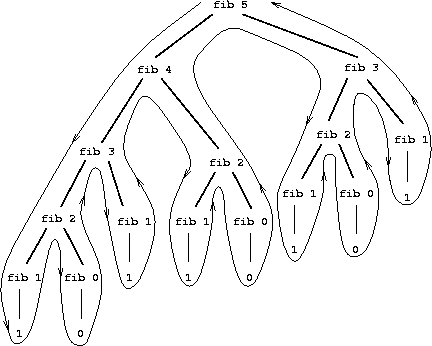

# Tree recursion

Пример *tree recursion* можно выразить через алгоритм рассчёта чисел Фибоначчи.

Общее правило можно описать следующим образом

```
fib(n) = {
    0, if n = 0
    1, if n = 1
    fib(n - 1) + fib(n - 2)
}
```

Можно быстро перенести этот пример на Scheme:
```scheme
(define (fib n)
 (cond ((= n 0) 0)
       ((= n 1) 1)
       (else (+ (fib (- n 1)) (fib (- n 2))))
 )
)
```
Если разложить получившуюся процеуру, то можно получить дерево:


Это очень неэффективный алгортим, например можно видеть как вычисление `fib(3)` повторяется несколько раз.

Можно сформулировать итеративный алгоритм вычисления, путём ввода двух переменных `a, b`, инициализируемых как `Fib(1) = 1, Fib(2) = 2`, и применять к ним трансформации:

```
a <- a + b
b <- a
```

После примения этого преобразования *n* раз, `a` будет равняться `Fib(n + 1)`, а `b` - `Fib(n)`.

Можно выразить это на Scheme:

```scheme
(define (fib n)
 (fib-iter 1 0 n)
)

(define (fib-iter a b count)
 (if (= count 0) 
    b
    (fib-iter (+ a b) a (- count 1))
 )
)
```
Второй метод вычисления - это линейная итерация, и количество шагов в ней значительно отличается от метода рекурсии.

Однако, tree recursion - не бесполезный процесс. Если описать процесс, который будет обрабатывать иерархически-структурированные данные (а не числа), то tree-recursion очень мощный инструмент (например интерпретатор Scheme используета tree-recursion для парсинга программы.)

## Example: Counting change

Задача: посчитать количество различных способов разменять *n* долларов, используя пол-доллара, четвертаки, dimes, nickels, pennies (я не знаю перевода этих единиц 😒).

У этой задачи есть простое решение с помощью рекурсивной процедуры. 

